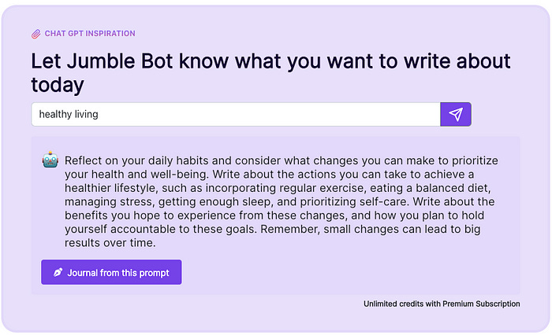
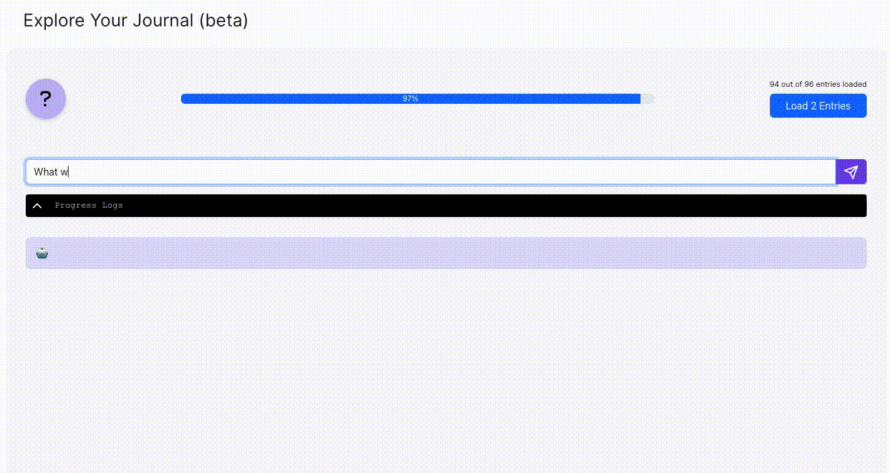

The benefits of **daily introspective journaling** are immense. This article explores how Large Language Models \(LLMs\) can enhance the benefits of journaling.

If you are not familiar with daily journaling, see this short guide and definition:

**Daily Introspective Journaling** : _A daily journaling ritual in which one writes in a stream of consciousness for a set number or pages or duration. Typically, journaling is done at the same time each day, in order to ingrain the practice as a habit._

## Journalin Benefits 

The benefits of journaling are most akin to those of meditation and therapy. They include improvement in narrative thinking, communication, clarity, tranquility, and problem solving.

Most people that journal don't just write, they also review past entries. The journal left behind is an invaluable artefact. By reviewing your own past journal entries, you can learn more about yourself by identifying patterns and studying how your own thinking evolves.

# **How LLM's Can Enhance Journaling**

In both journaling and review, LLM's can be leveraged to great effect.

## **Individualised Writing Prompt**

With LLMs we can provide contextual journaling prompts. Journaling prompts are not a new concept, but generally it is a just list of generic prompts. LLM’s enable us to generate a uniquely tailored prompt. It can be based on recent journal entries, goals, current projects, or any chosen topic on your mind.

## Journaling Assistant 

A second possibility enabled by LLM’s is a journaling assistant. This experience is similar to speaking with a therapist. The journaling assistant has memory of your past journal entries and a knowledge of modern therapeutic research and best practices. An LLM powered journaling assistant can help guide your thinking as you navigate life challenges. Conversation forces us to grapple with perspectives we would not consider in isolation. For example, a therapist will typically ask leading questions to help you see a situation more clearly. An LLM powered journaling assistant makes this possible in the comfort of home at a cost much lower than hiring a real therapist.

## Journaling Insights 

LLM’s bring a whole new dynamic to reviewing past journaling. In my old journals I would tag every entry, re-read every entry, highlighting important insights, then feed it all into a custom program to make it all searchable by topic over time. This was tedious to do but the benefits had been invaluable to me. The review process was responsible for much of my growth and achievements.

With LLM’s the tedium is no longer necessary. We can train a model on the journal entries and then generate the overview automatically. It can also be used to ask specific questions about ourselves, our habits, and our thinking. Questions like,

  * _What do I worry about most often?_

  * _What am I excited about?_

  * _What goals have I achieved this year?_

  * _What intentions remain unresolved?_

The more journal entries we have, the more value in this functionality.

**In the end, a journal is not just text. It is a personal fingerprint. Our own complexities are built into the intricacies of our recorded thoughts. Untangling it leads to improved self understanding. This is what we aim to bring you at Jumble Journal.**

We are building Jumble Journal to unlock the full potential of your personal journal with LLM technology. It is designed to help you find clarity and grow. We protect your journal with client-side encryption which means you have full ownership of your data.

Follow Jumble on Twitter, join our Discord, or Create an account.

We are a small team building Jumble in our spare time. If you’d like to support us, head over to Jumble and try it out! 

Follow Jumble on [Twitter](https://twitter.com/JumbleJournal) or [Create an account](https://jumblejournal.org/).

Originally published on [Substack](https://tonyoreglia.substack.com/p/how-ai-can-enhance-daily-journaling)
